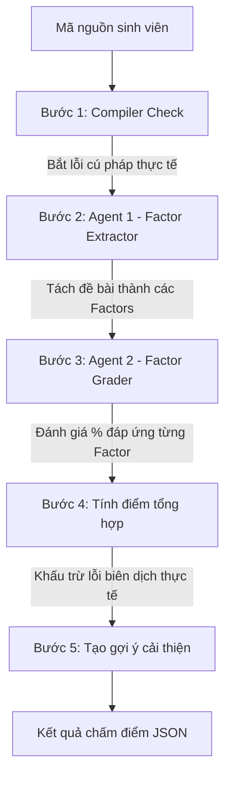

# Hướng Dẫn Sử Dụng Multi-Agent Assessor (Hệ Thống Đa Tác Nhân)

Hệ thống **Multi-Agent Assessor** là cơ chế đánh giá mã nguồn thông minh và toàn diện nhất trong CodeJudge. Khác với các bộ chấm điểm đơn tác nhân truyền thống (chỉ dùng duy nhất LLM để chấm), Multi-Agent Assessor kết hợp **trình biên dịch vật lý cục bộ** để bắt lỗi cú pháp và **nhiều tác nhân LLM phụ trợ** để chấm điểm logic nhằm mang lại độ chính xác cao nhất và phản hồi trực quan bằng tiếng Việt.

---

## 1. Quy Trình Chấm Điểm 5 Bước (Workflow)

Khi gọi phương thức `assess()`, hệ thống sẽ thực hiện tuần tự qua các bước:



1. **Bước 1 (Compiler Check)**: 
   Chạy trình biên dịch vật lý để kiểm tra lỗi cú pháp thực tế (bảo đảm tính khách quan). 
   * Với **Python**: Dùng hàm `compile()` tích hợp sẵn.
   * Với **C++**: Chạy lệnh `g++ -fsyntax-only` ở chế độ nền.
2. **Bước 2 (Agent 1 - Factor Extractor)**: 
   Tác nhân LLM 1 đóng vai trò Business Analyst phân tích đề bài và chia nhỏ thành **2 đến 5 yêu cầu logic/chức năng chính (Factors)**. Bước này hoàn toàn bỏ qua cú pháp và phương pháp giải cụ thể (không bắt buộc dùng cấu trúc dữ liệu nào trừ khi đề bài yêu cầu rõ ràng).
   * *Hỗ trợ Human-in-the-loop*: Có thể nạp danh sách Factor định nghĩa trước để bỏ qua bước này.
3. **Bước 3 (Agent 2 - Factor Grader)**: 
   Tác nhân LLM 2 đóng vai trò Trợ giảng chấm điểm, đánh giá mức độ đáp ứng (%) của mã nguồn đối với từng Factor (từ `0.0` đến `1.0`) kèm theo giải thích lý do chi tiết bằng tiếng Việt. Bước này bỏ qua lỗi cú pháp làm code không compile được (chỉ tập trung vào tư duy thuật toán).
4. **Bước 4 (Tính điểm tổng hợp)**:
   * **Điểm logic (thang 10)**: Trung bình cộng mức đáp ứng của các Factors (hoặc tổng có trọng số).
   * **Điểm trừ cú pháp**: Lỗi cú pháp được phân loại tự động và trừ điểm tương ứng:
     * *Warning* (unused variable, unused parameter...): Trừ **-0.25** điểm.
     * *Typo* (thiếu `;`, thiếu ngoặc `}`, `)`...): Trừ **-0.5** điểm.
     * *Major compiler error* (lỗi biên dịch nghiêm trọng khác): Trừ **-1.5** điểm.
     * *Giới hạn điểm phạt*: Tổng điểm trừ cú pháp tối đa là **-5.0** điểm.
   * **Điểm cuối cùng (thang 10)** = `max(0.0, Điểm logic - Điểm trừ cú pháp)`.
   * **Quy đổi điểm**: Nếu đề bài có quy định điểm tối đa (`question_max`), điểm trên thang 10 sẽ được tự động quy đổi tương ứng.
5. **Bước 5 (Tạo gợi ý cải thiện)**: 
   Tổng hợp các lỗi cú pháp biên dịch và các yêu cầu logic chưa đạt (mức đáp ứng < 100%) để đưa ra hướng dẫn cụ thể và trực quan bằng tiếng Việt cho sinh viên sửa lỗi.

---

## 2. Thiết Lập Môi Trường & Biến Hệ Thống (.env)

Để sử dụng Multi-Agent Assessor với các mô hình API đám mây (OpenAI, Gemini, Qwen, OpenRouter), bạn cần cấu hình các khóa API key trong file `.env` ở thư mục gốc của dự án.

1. **Tạo file `.env`**:
   Copy file template có sẵn trong dự án:
   ```bash
   cp .env_template .env
   ```
2. **Điền thông tin API keys**:
   Mở file `.env` vừa tạo và điền các khóa API tương ứng của bạn:
   ```env
   # Nếu dùng OpenRouter (Khuyên dùng và đang chạy trong dự án hiện tại)
   OPENROUTER_API_KEY=sk-or-v1-...

   # Nếu dùng các model trực tiếp của OpenAI (gpt-4o-mini, gpt-4, ...)
   OPENAI_API_KEY=sk-proj-...

   # Nếu dùng các model trực tiếp của Google Gemini (gemini-2.5-flash, gemini-pro, ...)
   GOOGLE_API_KEY=AIzaSy...

   # Nếu dùng các model trực tiếp của Alibaba Qwen (qwen-plus, qwen-turbo, ...)
   QWEN_API_KEY=sk-...
   ```

Hệ thống sử dụng thư viện `python-dotenv` để tự động load các biến môi trường này khi khởi tạo client. Khi sử dụng `provider="openrouter"`, client sẽ tự động tìm kiếm biến `OPENROUTER_API_KEY` (hoặc fallback về `OPENAI_API_KEY` nếu không tìm thấy).

---

## 3. Hướng Dẫn Sử Dụng Qua Python API

### 2.1 Ví dụ cơ bản
```python
from codejudge.core import MultiAgentAssessor, LLMFactory

# 1. Khởi tạo LLM Client qua OpenRouter (hoặc dùng direct provider như "gemini", "openai")
llm_client = LLMFactory.create(provider="openrouter", model_name="google/gemini-2.5-flash")

# 2. Khởi tạo Multi-Agent Assessor
assessor = MultiAgentAssessor(llm_client=llm_client)

# Đề bài và code của sinh viên
question = "Viết hàm tính giai thừa của một số nguyên dương n."
student_code = """
def giaithua(n):
    if n <= 1:
        return 1
    return n * giaithua(n-1
""" # Cố tình thiếu dấu đóng ngoặc ở cuối để test lỗi cú pháp

# 3. Thực hiện chấm điểm
result = assessor.assess(
    question_text=question,
    student_code=student_code,
    language="Python"
)

# 4. Hiển thị thông tin chấm điểm
print("--- KẾT QUẢ CHẤM ĐIỂM ---")
print(f"Điểm số logic gốc: {result['scoring']['factor_score_on_10']}")
print(f"Điểm phạt cú pháp: {result['scoring']['syntax_penalty_on_10']}")
print(f"Điểm số cuối cùng: {result['final_score']}")
print("\nDanh sách lỗi cú pháp từ compiler:")
for err in result['syntax_errors']:
    print(f"  x {err}")

print("\nĐánh giá từng yêu cầu logic:")
for factor, details in result['factor_evaluation'].items():
    print(f"  - Yêu cầu: {factor}")
    print(f"    Mức đáp ứng: {details['compliance'] * 100}%")
    print(f"    Nhận xét: {details['reasoning']}")

print("\nGợi ý sửa lỗi và cải thiện:")
for suggestion in result['suggestions']:
    print(suggestion)
```

### 2.2 Tùy chỉnh nâng cao (Human-in-the-loop & Cân bằng điểm số)
Nếu bạn muốn tự thiết lập các tiêu chí chấm điểm, trọng số điểm và mức phạt cú pháp:

```python
# Danh sách yêu cầu chấm điểm được viết sẵn (Bỏ qua bước Agent 1 tự động trích xuất)
pre_factors = [
    "Định nghĩa hàm giaithua nhận tham số n",
    "Xử lý đúng trường hợp biên n <= 1 (trả về 1)",
    "Thực hiện công thức đệ quy n * giaithua(n-1) chính xác"
]

# Thiết lập trọng số cho từng yêu cầu (Tổng trọng số sẽ tự động chuẩn hóa về 1.0)
factor_weights = {
    "Định nghĩa hàm giaithua nhận tham số n": 0.2,
    "Xử lý đúng trường hợp biên n <= 1 (trả về 1)": 0.3,
    "Thực hiện công thức đệ quy n * giaithua(n-1) chính xác": 0.5
}

# Tùy chỉnh mức phạt cho lỗi cú pháp biên dịch
syntax_penalties = {
    "warning": 0.1,    # Phạt lỗi cảnh báo nhẹ
    "typo": 0.3,       # Phạt lỗi chính tả cú pháp thiếu ngoặc/dấu chấm phẩy
    "major": 1.0       # Phạt lỗi logic biên dịch nghiêm trọng
}

result = assessor.assess(
    question_text="Viết hàm tính giai thừa của một số nguyên dương n.",
    student_code=student_code,
    language="Python",
    question_max=5.0,  # Quy đổi điểm tối đa về thang 5 điểm thay vì thang 10
    pre_extracted_factors=pre_factors,
    factor_weights=factor_weights,
    syntax_penalties=syntax_penalties
)

print(f"Điểm quy đổi (thang 5.0): {result['scoring']['scaled_score']}")
```

---

## 4. Chạy Kiểm Thử Bộ Dữ Liệu CoNaLa Qua CLI

Để chấm điểm hàng loạt tệp dữ liệu kiểm thử (ví dụ dataset CoNaLa) bằng hệ thống đa tác nhân, sử dụng file `evaluation/conala/score_conala_multi_agent.py`:

```bash
python evaluation/conala/score_conala_multi_agent.py \
  --json evaluation/conala/conala.json \
  --provider openrouter \
  --model google/gemini-2.5-flash \
  --source codex \
  --limit 20
```

### Các tham số CLI chính:
* `--json`: Đường dẫn file dữ liệu JSON (mặc định: `evaluation/conala/conala.json`).
* `--source`: Tên trường chứa code của ứng viên để chấm điểm (`baseline`, `tranx-annot`, `best-tranx`, `best-tranx-rerank`, `codex`, hoặc `all` để chấm tất cả).
* `--provider`: Nhà cung cấp LLM (`openai`, `gemini`, `qwen`, `local`).
* `--model`: Tên mô hình LLM để chấm (ví dụ: `gemini-2.5-flash`, `gpt-4o-mini`).
* `--api-key`: API key truyền trực tiếp (nếu không đặt trong file `.env`).
* `--output`: Tên file JSONL kết quả đầu ra (mặc định tự động sinh trong thư mục `output`).
* `--limit`: Số lượng mẫu cần chấm (để chạy thử nhanh).
* `--start`: Index bắt đầu chấm trong danh sách dữ liệu.
* `--config`: Đường dẫn tới file cấu hình JSON chứa các Factor viết sẵn và trọng số mong muốn cho từng mẫu dữ liệu.
  * **Vị trí khuyến nghị đặt file**: Bạn nên tạo thư mục và đặt file tại `evaluation/conala/configs/` (ví dụ: `evaluation/conala/configs/conala_hitl_config.json`).
* `--dry-run`: Chạy thử kiểm tra luồng và dataset mà không gọi LLM API để tránh tốn phí.

### Định dạng và vị trí đặt tệp cấu hình `--config` (HITL):

Để sử dụng cơ chế HITL (Human-in-the-Loop) nhằm nạp sẵn các yếu tố chấm điểm (factors), cấu hình trọng số cho từng yếu tố, và điều chỉnh mức phạt lỗi cú pháp cho bộ dữ liệu CoNaLa:

1. **Vị trí lưu trữ khuyến nghị**:
   * Bạn nên tạo một thư mục cấu hình riêng tại: `evaluation/conala/configs/`
   * Đặt tên tệp có ý nghĩa rõ ràng, ví dụ: `evaluation/conala/configs/conala_hitl_config.json`
2. **Cấu trúc chi tiết của tệp JSON**:
   * Tệp JSON là một đối tượng chứa các khóa ở cấp cao nhất tương ứng với **chỉ số (index) của mẫu dữ liệu** dạng chuỗi (ví dụ: `"0"`, `"1"`...). Chỉ số này bắt đầu từ `0` và phải khớp chính xác với số thứ tự của các bản ghi trong file dữ liệu gốc `conala.json`.
   * Bên trong mỗi đối tượng mẫu dữ liệu, bạn có thể thiết lập các trường sau:
     * `pre_extracted_factors` *(Mảng các chuỗi)*: Danh sách các yêu cầu logic cần chấm điểm cho bài thi này.
     * `factor_weights` *(Đối tượng)*: Trọng số của từng yêu cầu. Key của đối tượng này **phải trùng khớp hoàn toàn** với các chuỗi đã khai báo trong mảng `pre_extracted_factors`. Tổng các giá trị trọng số nên bằng `1.0` (nếu không hệ thống sẽ tự động chuẩn hóa tỉ lệ về `1.0`).
     * `syntax_penalties` *(Đối tượng)*: Thiết lập mức khấu trừ điểm cụ thể cho từng lỗi cú pháp biên dịch được phát hiện thực tế:
       * `"warning"`: Điểm phạt cho các cảnh báo trình biên dịch nhẹ (ví dụ: unused variables).
       * `"typo"`: Điểm phạt cho lỗi viết sai chính tả cú pháp nhỏ (ví dụ: thiếu dấu `;`, thiếu ngoặc `}`).
       * `"major"`: Điểm phạt cho các lỗi cú pháp làm hỏng biên dịch nghiêm trọng.

```json
{
  "0": {
    "pre_extracted_factors": [
      "Định nghĩa hàm chuyển đổi danh sách thành chuỗi",
      "Xử lý dấu phân cách tùy chọn"
    ],
    "factor_weights": {
      "Định nghĩa hàm chuyển đổi danh sách thành chuỗi": 0.6,
      "Xử lý dấu phân cách tùy chọn": 0.4
    },
    "syntax_penalties": {
      "warning": 0.2,
      "typo": 0.4,
      "major": 1.2
    }
  },
  "1": {
    "pre_extracted_factors": [
      "Đọc dữ liệu từ đường dẫn chỉ định",
      "Xử lý biệt lệ file không tồn tại"
    ]
  }
}
```
*Lưu ý: Index (ví dụ `"0"`, `"1"`) phải khớp với thứ tự (chỉ số) của mẫu dữ liệu trong file dataset JSON.*

### 4.4 Chạy tính toán Metrics hiệu năng chấm điểm cho CoNaLa

Sau khi có tệp JSONL kết quả chấm điểm của bộ dữ liệu CoNaLa, bạn có thể chạy tệp [calculate_metric.py](file:///home/knhung/KLTN/CodeJudge/evaluation/conala/calculate_metric.py) để phân tích các chỉ số tương quan chất lượng chấm điểm của mô hình:

```bash
python evaluation/conala/calculate_metric.py evaluation/conala/output/your_output_file.jsonl
```

*Lưu ý: Nếu không truyền đường dẫn file, script sẽ tự động tìm và phân tích file `.jsonl` mới nhất trong thư mục `evaluation/conala/output/`.*

Các chỉ số được thống kê bao gồm:
1. **Pearson R, Spearman R & Kendall's Tau**: Hệ số tương quan tuyến tính và tương quan thứ bậc giữa điểm thực tế do con người chấm (`grade_reference`) và điểm dự đoán của hệ thống (quy đổi ra thang điểm 4).
2. **MAE (Mean Absolute Error) & RMSE**: Sai lệch tuyệt đối trung bình và căn sai lệch bình phương trên thang điểm 4.
3. **Mean Bias**: Độ lệch trung bình (mang dấu `+` là chấm nới tay, mang dấu `-` là chấm khắt khe hơn so với người đánh giá).
4. **Usage & Est. Cost**: Tổng lượng token tiêu thụ và chi phí API ước tính (USD và VNĐ).
5. **Avg Runtime**: Thời gian phản hồi trung bình trên mỗi lượt đánh giá.

---

## 5. Chạy Kiểm Thử Bộ Dữ Liệu Thực Tế HCMUS

Hệ thống hỗ trợ chạy kiểm thử trên tập dữ liệu thực tế cấu trúc đề thi tự luận/thực hành từ HCMUS, được đặt trong thư mục [evaluation/hcmus](file:///home/knhung/KLTN/CodeJudge/evaluation/hcmus).

### 5.1 Cấu trúc thư mục dữ liệu HCMUS
* **Tệp danh sách thi**: [hcmus_dataset.csv](file:///home/knhung/KLTN/CodeJudge/evaluation/hcmus/hcmus_dataset.csv) chứa thông tin các dòng bài thi bao gồm `id`, `language` (ví dụ `C++`), `problem_id` (ví dụ `1_final`), `student_id`, và `expect_grade` (điểm gốc của giảng viên).
* **Thư mục đề bài**: [problems/](file:///home/knhung/KLTN/CodeJudge/evaluation/hcmus/problems) chứa các tệp văn bản `.txt` của đề bài (ví dụ `1_final.txt`). Đề bài sẽ được hệ thống phân tách thành các câu hỏi riêng biệt dựa trên các tiêu đề như `Câu 1`, `Bài 2`, v.v.
* **Thư mục mã nguồn học sinh**: [data_code/](file:///home/knhung/KLTN/CodeJudge/evaluation/hcmus/data_code) chứa các thư mục bài nộp tương ứng với cột `id` trong CSV (ví dụ thư mục `1/` chứa `Bai01.cpp`, `Bai02.cpp`...). Các tệp code được sắp xếp theo thứ tự chữ và số để tự động ánh xạ 1-1 với thứ tự câu hỏi đã phân tách từ đề bài.

### 5.2 Lệnh chạy chấm điểm với Multi-Agent
Chạy file [score_with_multi_agent.py](file:///home/knhung/KLTN/CodeJudge/evaluation/hcmus/score_with_multi_agent.py) để chấm điểm toàn bộ tập dữ liệu:

```bash
python evaluation/hcmus/score_with_multi_agent.py \
  --csv evaluation/hcmus/hcmus_dataset.csv \
  --provider openrouter \
  --model google/gemini-2.5-flash \
  --limit 5

python evaluation/hcmus/score_with_multi_agent.py \
  --csv evaluation/hcmus/hcmus_dataset.csv \
  --provider openrouter \
  --model meta-llama/llama-3-8b-instruct \
  --config evaluation/hcmus/configs/hcmus_tuned_weights.json \
  --output evaluation/hcmus/output_to_share/llama-3-8b-instruct_hcmus_multi_agent_tuned.jsonl 

  python evaluation/hcmus/score_with_multi_agent.py \
  --csv evaluation/hcmus/hcmus_dataset.csv \
  --provider openrouter \
  --model qwen/qwen-2.5-7b-instruct \
  --config evaluation/hcmus/configs/hcmus_tuned_weights.json \
  --output evaluation/hcmus/output_to_share/report_11/qwen-2.5-7b-instruct_hcmus_multi_agent_tuned.jsonl 
```

Các tham số CLI chính của HCMUS Multi-Agent:
* `--csv`: Đường dẫn đến file danh sách bài thi (mặc định: `evaluation/hcmus/hcmus_dataset.csv`).
* `--provider` và `--model`: Nhà cung cấp và tên mô hình LLM.
* `--output`: Tệp JSONL đầu ra.
* `--resume`: Bật chế độ tiếp tục chạy (append), hệ thống sẽ bỏ qua các `id` bài thi đã chấm xong trong file output.
* `--limit`: Giới hạn số lượng bài thi chấm để chạy thử nhanh.
* `--start`: Index bắt đầu chấm trong danh sách CSV.
* `--config`: Đường dẫn tới file config HITL chứa các factor/trọng số soạn trước theo từng bài thi.
  * **Vị trí khuyến nghị đặt file**: Bạn nên tạo thư mục và đặt file tại `evaluation/hcmus/configs/` (ví dụ: `evaluation/hcmus/configs/hcmus_hitl_config.json`).
* `--dry-run`: Chạy kiểm tra cấu trúc thư mục, phân tách câu hỏi, compiler check và ánh xạ tệp mã nguồn mà không gọi LLM API thực tế.

### 5.3 Định dạng và vị trí đặt tệp cấu hình `--config` (HITL) cho HCMUS

Cơ chế HITL của HCMUS cho phép định nghĩa trước các yếu tố chấm điểm, trọng số điểm và lỗi cú pháp theo cấu trúc đề thi nhiều câu hỏi.

1. **Vị trí lưu trữ khuyến nghị**:
   * Bạn nên tạo một thư mục cấu hình riêng tại: `evaluation/hcmus/configs/`
   * Đặt tên tệp cấu hình rõ ràng, ví dụ: `evaluation/hcmus/configs/hcmus_hitl_config.json`
2. **Cấu trúc chi tiết của tệp JSON**:
   * **Key cấp 1**: Là `problem_id` của đề thi dạng chuỗi (ví dụ: `"1_final"`, `"48_midterm-123"`...), phải khớp chính xác với cột `problem_id` trong file CSV danh sách bài thi `hcmus_dataset.csv` và tên file đề thi trong thư mục `problems/`.
   * **Key cấp 2**: Là chỉ số thứ tự của câu hỏi trong đề thi dạng chuỗi (ví dụ: `"1"`, `"2"`...), bắt đầu từ `"1"` và khớp với thứ tự các câu hỏi được phân tách từ đề bài.
   * **Giá trị của Key cấp 2**: Là đối tượng chứa cấu hình tùy chọn:
     * `pre_extracted_factors` *(Mảng chuỗi)*: Danh sách các yêu cầu logic của câu hỏi tương ứng.
     * `factor_weights` *(Đối tượng)*: Ánh xạ giữa tên factor và trọng số điểm tương ứng (key của đối tượng này phải khớp hoàn toàn với chuỗi trong `pre_extracted_factors`).
     * `syntax_penalties` *(Đối tượng)*: Định nghĩa mức điểm phạt lỗi biên dịch riêng cho câu hỏi này (`warning`, `typo`, `major`).

```json
{
  "1_final": {
    "1": {
      "pre_extracted_factors": [
        "Định nghĩa cấu trúc struct SinhVien đầy đủ thuộc tính",
        "Hàm nhập thông tin SinhVien chính xác"
      ],
      "factor_weights": {
        "Định nghĩa cấu trúc struct SinhVien đầy đủ thuộc tính": 0.4,
        "Hàm nhập thông tin SinhVien chính xác": 0.6
      },
      "syntax_penalties": {
        "warning": 0.1,
        "typo": 0.3,
        "major": 1.0
      }
    },
    "2": {
      "pre_extracted_factors": [
        "Hàm tính điểm trung bình chính xác",
        "Xếp loại học lực chuẩn xác"
      ]
    }
  },
  "48_midterm-123": {
    "1": {
      "pre_extracted_factors": [
        "Giải thuật đệ quy tối ưu",
        "Xử lý các điều kiện biên"
      ]
    }
  }
}
```

### 5.4 Chạy tính toán Metrics hiệu năng chấm điểm
Sau khi có tệp JSONL kết quả đầu ra, bạn có thể phân tích và tính toán các chỉ số thống kê chất lượng chấm điểm của mô hình bằng cách chạy [calculate_metric.py](file:///home/knhung/KLTN/CodeJudge/evaluation/hcmus/calculate_metric.py):

```bash
python evaluation/hcmus/calculate_metric.py evaluation/hcmus/output/your_output_file.jsonl
```

*Lưu ý: Nếu không truyền đường dẫn file, script sẽ tự động tìm và phân tích file `.jsonl` mới nhất trong thư mục `evaluation/hcmus/output/`.*

Các chỉ số được thống kê tự động bao gồm:
1. **Kendall's Tau & Spearman's R**: Hệ số tương quan giữa điểm thực tế của giảng viên (`expect_grade`) và điểm dự đoán của mô hình (`predicted_total_score`). Hệ số càng gần 1.0 nghĩa là mô hình chấm điểm càng sát với giảng viên.
2. **MAE (Mean Absolute Error) & RMSE**: Sai lệch tuyệt đối trung bình và căn sai lệch bình phương.
3. **Mean Bias**: Độ lệch trung bình (nếu kết quả mang dấu `+` thì mô hình chấm nới tay, dấu `-` thì mô hình chấm khắt khe hơn so với giảng viên).
4. **Token Usage & Est. Cost**: Thống kê số lượng token tiêu thụ và ước tính chi phí API tương ứng ra USD và VNĐ.
5. **Avg Runtime**: Thời gian phản hồi trung bình trên mỗi bài thi.

---

## 6. Giao Diện Web Demo Trực Quan (FastHTML)

Để người dùng dễ dàng tương tác và trải nghiệm quy trình chấm điểm đa tác nhân, dự án cung cấp một giao diện web trực quan tại tệp [app.py](file:///home/knhung/KLTN/CodeJudge/app.py), được xây dựng trên nền tảng **FastHTML**, kết hợp **Tailwind CSS**, **DaisyUI** và trình soạn thảo mã nguồn chuyên nghiệp **Monaco Editor**.

### 6.1 Các tính năng chính của Web Demo
1. **Trình soạn thảo Monaco Editor**: Hỗ trợ tô sáng cú pháp (syntax highlighting) cho Python và C++, tự động thay đổi ngôn ngữ theo lựa chọn.
2. **Tuỳ chọn mô hình đa dạng**: Cho phép chọn nhanh các mô hình LLM thông qua OpenRouter (như `google/gemini-2.5-flash`, `meta-llama/llama-3.3-70b-instruct:free`, `deepseek/deepseek-chat`...).
3. **Theo dõi tiến trình trực tiếp (HITL)**: Hiển thị trạng thái hoàn thành theo thời gian thực cho từng bước trong quy trình 4 bước (compiler check, trích xuất tiêu chí, chấm điểm tiêu chí, tổng hợp kết quả) thông qua cơ chế HTMX Polling.
4. **Báo cáo trực quan**: Trình bày bảng điểm chi tiết cho từng tiêu chí (factor), mức độ đáp ứng (%), lập luận giải thích và đề xuất cải thiện code cụ thể.

### 6.2 Hướng dẫn khởi chạy Web Demo
Từ thư mục gốc của dự án, bạn khởi chạy ứng dụng bằng lệnh:
```bash
python app.py
```
Sau đó, truy cập giao diện web tại địa chỉ: `http://localhost:5000` hoặc `http://127.0.0.1:5000`.

### 6.3 Hướng dẫn xử lý xung đột cổng (Port Conflict) và tắt cổng an toàn
Khi chạy hoặc khởi động lại máy chủ, bạn có thể gặp lỗi cổng mạng bị chiếm dụng:
`ERROR: [Errno 98] error while attempting to bind on address ('0.0.0.0', 5000): address already in use`

Để xử lý và giải phóng cổng `5000` một cách an toàn, bạn thực hiện theo các bước sau:

#### A. Trên hệ điều hành Linux (Khuyên dùng)
1. **Kiểm tra tiến trình đang chiếm dụng cổng**:
   ```bash
   lsof -i :5000
   ```
   hoặc:
   ```bash
   fuser 5000/tcp
   ```
2. **Dừng/Tắt tiến trình chiếm dụng cổng**:
   * **Cách nhanh nhất (dừng trực tiếp bằng cổng)**:
     ```bash
     fuser -k 5000/tcp
     ```
   * **Dừng bằng ID tiến trình (PID)**:
     Sau khi chạy lệnh kiểm tra và tìm thấy cột `PID` (ví dụ `4875`), bạn chạy lệnh:
     ```bash
     kill -9 <PID>
     ```
     *(Ví dụ: `kill -9 4875`)*

#### B. Trên hệ điều hành macOS
1. **Tìm và tắt tiến trình chiếm dụng cổng**:
   ```bash
   kill -9 $(lsof -t -i:5000)
   ```

Sau khi giải phóng cổng, bạn có thể chạy lại lệnh `python app.py` để khởi động máy chủ một cách bình thường.

