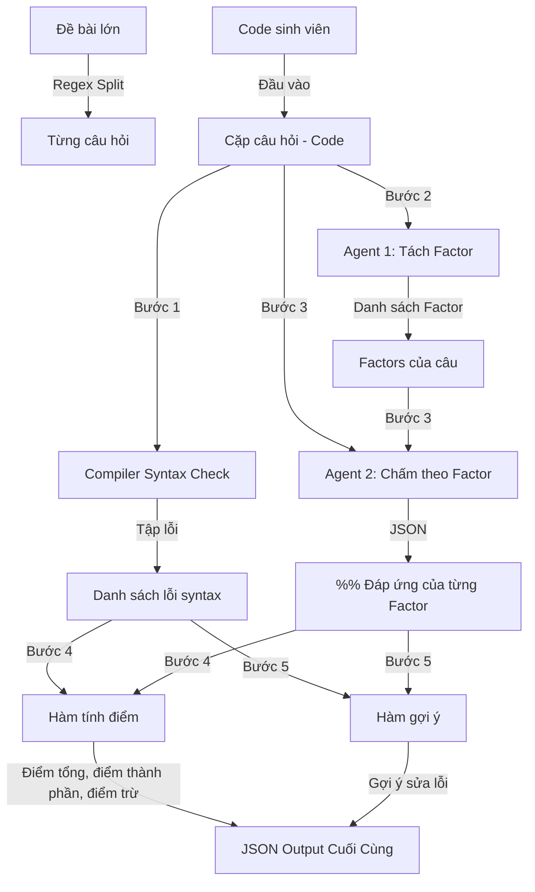

# Implementation Plan - Chuyển đổi sang hệ thống Multi-Agent & Compiler-based Grading

## Goal Description

Chuyển đổi luồng chấm điểm từ phương pháp bài báo CodeJudge hiện tại (sử dụng 1 prompt tích hợp với metrics chấm điểm phức tạp) sang luồng mới:
1. **Kiểm tra cú pháp bằng Trình biên dịch (Compiler)**: Sử dụng compiler thực tế (g++ cho C++ hoặc built-in compiler của Python) để phát hiện và liệt kê danh sách lỗi cú pháp cứng.
2. **Multi-Agent tách Prompt**:
   - **Agent 1 (Tách Factor)**: Đề bài (hoặc từng câu đã tách bằng regex) sẽ được gửi cho LLM để phân tích và trích xuất ra các yêu cầu chức năng/logic độc lập (gọi là các **Factor**).
   - **Agent 2 (Chấm điểm theo Factor)**: Dùng LLM chấm bài làm của sinh viên theo từng Factor độc lập (cho ra % đáp ứng từ 0% đến 100%), hoàn toàn bỏ qua các lỗi cú pháp (vì compiler đã đảm nhận).
3. **Hàm tính điểm tổng hợp**: Điểm số được tính bằng tổng mức độ đáp ứng các Factor trừ đi các điểm phạt do lỗi cú pháp (compiler phát hiện) nếu có.
4. **Hàm gợi ý sửa lỗi**: Tạo gợi ý chi tiết dựa trên các Factor chưa đáp ứng (< 100%) và các lỗi compiler gặp phải.
5. **Output**: Trả về dữ liệu dạng JSON ở từng bước và output cuối cùng chứa: điểm tổng, điểm thành phần các factor, điểm trừ lỗi cú pháp, gợi ý chi tiết.

---

## Proposed Changes

Để xây dựng hệ thống mới mà không phá vỡ code hiện tại, ta sẽ thêm các file phụ trợ và module chấm điểm mới, đồng thời xuất bản chúng trong core engine.



---

### 1. Core Engine

#### [NEW] [compiler_helper.py](file:///home/knhung/KLTN/CodeJudge/codejudge/core/compiler_helper.py)
Chứa các hàm kiểm tra lỗi cú pháp thực tế cho C++ và Python.

- **`check_syntax(code: str, language: str) -> List[str]`**:
  - Nhận vào code và ngôn ngữ (`cpp` hoặc `python`).
  - Nếu là `cpp`: Ghi code ra file tạm trong workspace, chạy lệnh `g++ -fsyntax-only` (hoặc `g++ -c`) bằng `subprocess`, thu thập `stderr` để lấy toàn bộ thông báo lỗi cú pháp.
  - Nếu là `python`: Sử dụng built-in function `compile(code, '<student_code>', 'exec')`. Nếu quăng lỗi `SyntaxError`, bắt lại thông tin chi tiết (dòng, nội dung lỗi).
  - Trả về: List các chuỗi mô tả lỗi (rỗng nếu không có lỗi cú pháp).

#### [NEW] [multi_agent_assessor.py](file:///home/knhung/KLTN/CodeJudge/codejudge/core/multi_agent_assessor.py)
Chứa Class `MultiAgentAssessor` điều phối toàn bộ luồng Multi-Agent mới.

- **`MultiAgentAssessor`**:
  - `__init__(self, llm_client: LLMClient = None)`
  - **`extract_factors(self, question_text: str) -> List[str]`**:
    - Gửi prompt yêu cầu LLM phân tích đề bài câu hỏi và tách thành các yêu cầu logic/chức năng (Factors) cốt lõi (bỏ qua syntax).
    - Trả về: List các factor (ví dụ: `["Hàm đọc file đúng định dạng", "Struct Pokemon đầy đủ thuộc tính", "Hàm in danh sách định dạng chính xác"]`).
  - **`assess_factors(self, student_code: str, factors: List[str], language: str) -> Dict[str, Dict[str, Any]]`**:
    - Gửi code và danh sách factors cho LLM, yêu cầu chấm % đáp ứng cho mỗi factor (từ 0.0 đến 1.0) và giải thích ngắn gọn, lưu ý LLM bỏ qua hoàn toàn lỗi cú pháp.
    - Trả về: JSON mapping factor -> `{"compliance": float, "reasoning": str}`.
  - **`calculate_score(self, factor_eval: Dict[str, Dict[str, Any]], syntax_errors: List[str]) -> Dict[str, Any]`**:
    - Tính điểm đáp ứng: `average(compliance_percentages) * 10.0`.
    - Tính điểm trừ cú pháp (ví dụ: trừ `2.0` điểm cho mỗi lỗi cú pháp compiler tìm thấy, hoặc trừ flat `5.0` điểm nếu có bất kì lỗi compiler nào).
    - Tính điểm tổng cuối cùng: `max(0.0, score_factor - score_penalty)`.
  - **`generate_suggestions(self, factor_eval: Dict[str, Dict[str, Any]], syntax_errors: List[str]) -> List[str]`**:
    - Tạo gợi ý sửa đổi dựa trên các factor có compliance < 1.0 và các lỗi syntax từ compiler.
  - **`assess(self, question_text: str, student_code: str, language: str) -> Dict[str, Any]`**:
    - Kết hợp tất cả các bước trên để chấm một cặp đề-code. Trả về JSON chứa điểm tổng, điểm thành phần các factor, lỗi syntax, gợi ý sửa lỗi.

#### [MODIFY] [__init__.py](file:///home/knhung/KLTN/CodeJudge/codejudge/core/__init__.py)
Đăng ký import và export `MultiAgentAssessor` để các module khác dễ dàng gọi.
- Thêm `from .multi_agent_assessor import MultiAgentAssessor`
- Thêm `"MultiAgentAssessor"` vào danh sách `__all__`

---

### 2. Evaluation Scripts

#### [NEW] [score_with_multi_agent.py](file:///home/knhung/KLTN/CodeJudge/evaluation/hcmus/score_with_multi_agent.py)
Kế thừa cấu trúc từ `score_with_codejudge.py` nhưng tích hợp luồng Multi-Agent mới để đánh giá HCMUS dataset.

- **`split_questions(problem_text: str) -> List[str]`**: Sử dụng regex chia đề bài lớn thành các câu nhỏ (Câu 1, Câu 2...).
- **`evaluate_row(...)`**:
  - Với mỗi học sinh, lấy danh sách code và ghép đôi với câu tương ứng.
  - Chạy `MultiAgentAssessor.assess(...)` để lấy kết quả chấm cho từng câu.
  - Tính tổng điểm của cả đề bài (tổng điểm quy đổi của các câu dựa trên `question_max` tương ứng).
  - Xuất ra file JSONL kết quả chi tiết từng câu và tổng điểm toàn đề bài.

---

## Verification Plan

### Automated Tests
Chúng ta sẽ thêm file test mới:
#### [NEW] `codejudge/tests/test_multi_agent.py`
- Test `compiler_helper` kiểm tra syntax của code Python lỗi và code Python đúng.
- Test `compiler_helper` kiểm tra syntax của code C++ lỗi (chỉ chạy subprocess g++ nếu môi trường có sẵn g++, nếu không sẽ cảnh báo/skip).
- Test mock LLM responses cho `MultiAgentAssessor.extract_factors` và `MultiAgentAssessor.assess_factors` để kiểm tra độ tin cậy và việc tính toán điểm số.
- Chạy kiểm thử bằng: `pytest codejudge/tests/test_multi_agent.py -v`

### Manual Verification
Chạy thử nghiệm script chấm điểm trên dữ liệu mẫu HCMUS:
```bash
python evaluation/hcmus/score_with_multi_agent.py --csv evaluation/hcmus/hcmus_dataset.csv --limit 2 --provider openai --model gpt-4o-mini
```
Kiểm tra file output JSONL xem cấu trúc có đúng như mong đợi (chứa điểm tổng, điểm thành phần các factor, lỗi syntax và các gợi ý sửa lỗi).
